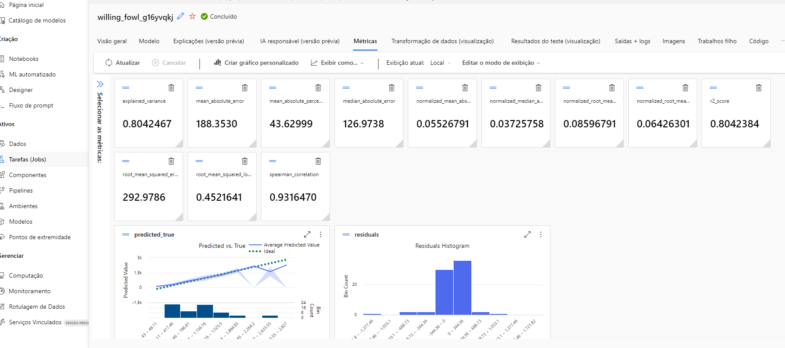

## Desafio: Trabalhando com Machine Learning na Prática no Azure ML

1. Crie um novo repositório no github com um nome a sua preferência
2. Crie um modelo de previsão com seus devidos pontos de extremidade configurados
3. Escreva o passo a passo desse processo em um readme.md de como você chegou nessa etapa
4. Salve nesse repositório o readme.md e o arquivo .json de pontos de extremidade
5. Compartilhe conosco o link desse repositório através do botão 'entregar projeto'

Explore Azure AI Services: 
https://microsoftlearning.github.io/mslearn-ai-fundamentals/Instructions/Labs/02-content-safety.html

Explore Automated Machine Learning in Azure Machine Learning:
https://microsoftlearning.github.io/mslearn-ai-fundamentals/Instructions/Labs/01-machine-learning.html

<h1> Avalie o melhor modelo </h1>
Quando o trabalho automatizado de aprendizado de máquina for concluído, você poderá revisar o melhor modelo treinado.

Na guia Visão geral do trabalho automatizado de aprendizado de máquina, observe o melhor resumo do modelo.

Observação: Você poderá ver uma mensagem com o status “Aviso: pontuação de saída especificada pelo usuário alcançada…”. Esta é uma mensagem esperada. Continue para a próxima etapa.

Selecione o texto em Nome do algoritmo do melhor modelo para visualizar seus detalhes.

Selecione a guia Métricas e selecione os gráficos residuais e predito_true se eles ainda não estiverem selecionados.

Revise os gráficos que mostram o desempenho do modelo. O gráfico de resíduos mostra os resíduos (as diferenças entre os valores previstos e reais) como um histograma. O gráfico predito_true compara os valores previstos com os valores verdadeiros.

<h1> Implantar e testar o modelo </h1>

Na guia Modelo do melhor modelo treinado pelo seu trabalho automatizado de machine learning, selecione Implantar e use a opção de serviço Web para implantar o modelo com as seguintes configurações:

Nome : prever-aluguéis
Descrição : Prever aluguel de bicicletas
Tipo de computação : Instância de Contêiner do Azure
Habilitar autenticação : selecionado

Aguarde o início da implantação – isso pode levar alguns segundos. O status de implantação do endpoint de previsão de aluguel será indicado na parte principal da página como Running .

Aguarde até que o status da implantação mude para Succeeded . Isso pode levar de 5 a 10 minutos.
Testar o serviço implantado
Agora você pode testar seu serviço implantado.

No estúdio Azure Machine Learning, no menu esquerdo, selecione Endpoints e abra o ponto final em tempo real de previsão de alugueres .

Na página do endpoint em tempo real de previsão de aluguel, visualize a guia Teste .

No painel Dados de entrada para testar o endpoint , substitua o modelo JSON pelos seguintes dados de entrada:

Código
 {
   "Inputs": { 
     "data": [
       {
         "day": 1,
         "mnth": 1,   
         "year": 2022,
         "season": 2,
         "holiday": 0,
         "weekday": 1,
         "workingday": 1,
         "weathersit": 2, 
         "temp": 0.3, 
         "atemp": 0.3,
         "hum": 0.3,
         "windspeed": 0.3 
       }
     ]    
   },   
   "GlobalParameters": 1.0
 }
Clique no botão Testar .

Revise os resultados do teste, que incluem um número previsto de aluguéis com base nos recursos de entrada - semelhante a este:

Código
 {
   "Results": [
     444.27799000000000
   ]
 }

O painel de teste pegou os dados de entrada e usou o modelo treinado para retornar o número previsto de aluguéis.

Abaixo os meus testes:

